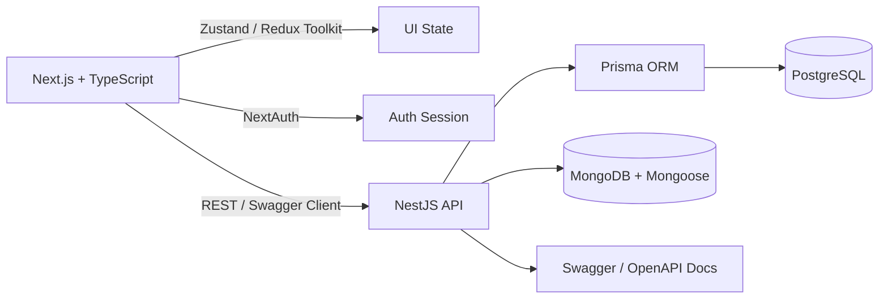

<div align="center">


<a href="https://git.io/typing-svg">
  
</a>

<br/>


<br/><br/>

<a href="https://ranakhanweb.vercel.app/"></a>
<a href="https://www.linkedin.com/in/rana-khan-dev/"></a>
<a href="mailto:ranakhandev2025@gmail.com"></a>
<a href="https://github.com/ranakhan-25"></a>

</div>

<br/>


---

## 👨‍💻 About Me

```ts
const atikul = {
  name: "Atikul Haq Rana",
  role: "Front-End Developer → Full-Stack (MERN + NestJS + PostgreSQL)",
  focus: ["Pixel-perfect UI", "Smooth animations", "Type-safe APIs", "Clean architecture"],
  currentlyLearning: ["NestJS", "PostgreSQL", "Prisma", "Swagger / OpenAPI", "Express.js", "MongoDB"],
  funFact: "I turn coffee and curiosity into production-ready interfaces ☕",
  motto: "Code is not just logic, it's creativity turned into reality.",
} as const;
```

---

## 🛠️ Tech Stack

### 🎨 Frontend
<p align="center">
  
</p>

### 🧠 State Management & Auth
<p align="center">
  
  
  
  
</p>

### ⚙️ Backend, Database & API
<p align="center">
  
  
</p>

### 🎬 Design, Animation & Tools
<p align="center">
  
  
</p>

---

## 🧩 Architecture Snapshot



---

## 🌱 Currently Learning

<div align="center">
  
</div>

<br/>

| Skill | Progress |
|---|---|
| Frontend (React / Next.js) |  |
| State Management (Redux / Zustand) |  |
| Authentication (NextAuth) |  |
| Backend (Node / Express / NestJS) |  |
| API Docs (Swagger) |  |
| Database (PostgreSQL / Prisma) |  |

---

## 📊 GitHub Stats

<div align="center">
  
  
</div>

<div align="center">
  
</div>

<div align="center">
  
</div>

---

## 🏆 Trophies

<div align="center">
  
</div>

---

## 🤝 Let's Connect

<div align="center">

📫 **Email:** [ranakhandev2025@gmail.com](mailto:ranakhandev2025@gmail.com)
🌐 **Portfolio:** [ranakhanweb.vercel.app](https://ranakhanweb.vercel.app/)
💼 **LinkedIn:** [rana-khan-dev](https://www.linkedin.com/in/rana-khan-dev/)
🐙 **GitHub:** [ranakhan-25](https://github.com/ranakhan-25)

<br/>


</div>
