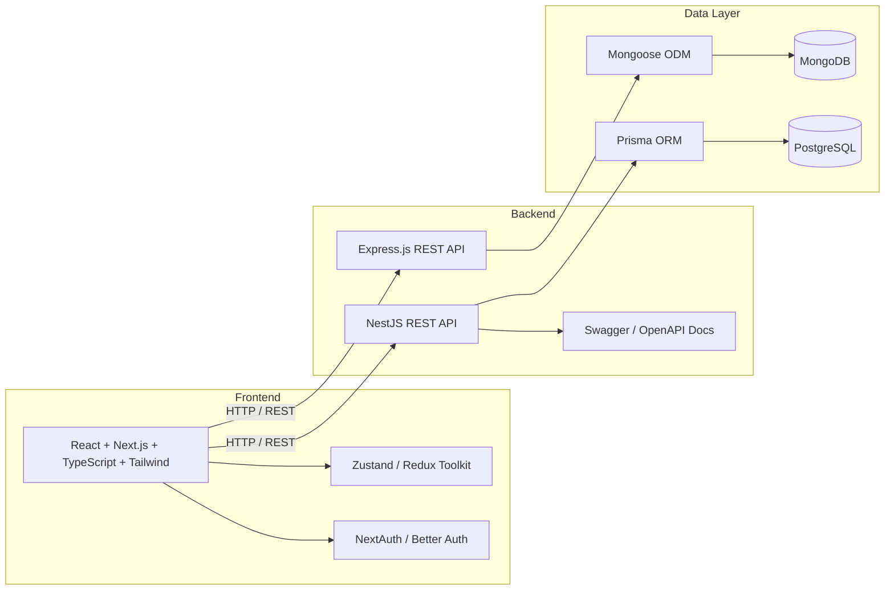

<div align="center">


<a href="https://git.io/typing-svg">
  
</a>

<br/>


<br/><br/>

<a href="https://ranakhanweb.vercel.app/"></a>
<a href="https://www.linkedin.com/in/rana-khan-dev/"></a>
<a href="mailto:ranakhandev2025@gmail.com"></a>
<a href="https://github.com/ranakhan-25"></a>

</div>

<br/>


---

## 👨‍💻 About Me

```ts
const atikul = {
  name: "Atikul Haq Rana",
  role: "Full-Stack Developer (ReactJS + Next.js + NodeJS + ExpressJS + NestJS + Mongodb + PostgreSQL)",
  focus: [
    "Pixel-perfect, responsive UI",
    "Type-safe APIs end to end",
    "Clean, modular architecture",
    "Smooth animations & great UX",
  ],
  stack: {
    frontend: ["Next.js", "React", "TypeScript", "Tailwind CSS"],
    backend: ["NestJS", "Node.js", "Express.js"],
    database: ["PostgreSQL", "Prisma", "MongoDB"],
  },
  currentlyLearning: ["NestJS", "PostgreSQL", "Prisma"],
  funFact: "I turn coffee and curiosity into production-ready products ☕",
  motto: "Code is not just logic, it's creativity turned into reality.",
} as const;
```

---

## 🛠️ Tech Stack

### 🎨 Frontend
<p align="center">
  
</p>

### 🧠 State Management & Auth
<p align="center">
  
  
  
  
</p>

### ⚙️ Backend & API
<p align="center">
  
</p>

### 🗄️ Database & ORM
<p align="center">
  
  
</p>

### 🎬 Design, Animation & DevTools
<p align="center">
  
  
</p>

---

## 🧩 Full-Stack Architecture



---

## 🚀 What I Build

- 🖥️ **Frontend:** responsive, accessible interfaces with Next.js, TypeScript and Tailwind
- ⚙️ **Backend:** modular REST APIs with NestJS (controllers, services, guards, DTO validation)
- 🗄️ **Database:** relational schemas, migrations and type-safe queries with Prisma + PostgreSQL
- 🔐 **Auth:** session and token based authentication with NextAuth / Better Auth
- 📚 **Docs:** clean API documentation with Swagger / OpenAPI

---

## 🌱 Currently Learning

<div align="center">
  
</div>

<br/>

| Skill | Progress |
|---|---|
| Frontend (React / Next.js) |  |
| State Management (Redux / Zustand) |  |
| Authentication (Better Auth / Firebase) |  |
| Backend (Node / Express / MongoDB) |  |
| 🔥 NestJS *(learning)* |  |
| 🔥 PostgreSQL *(learning)* |  |
| 🔥 Prisma *(learning)* |  |
---

## 📊 GitHub Stats

<div align="center">


<br/>


<br/><br/>

<table>
  <tr>
    <td align="center" width="50%">
      
    </td>
    <td align="center" width="50%">
      
    </td>
  </tr>
</table>


<br/><br/>


</div>


## 🤝 Let's Connect

<div align="center">

📫 **Email:** [ranakhandev2025@gmail.com](mailto:ranakhandev2025@gmail.com)
🌐 **Portfolio:** [ranakhanweb.vercel.app](https://ranakhanweb.vercel.app/)
💼 **LinkedIn:** [rana-khan-dev](https://www.linkedin.com/in/rana-khan-dev/)
🐙 **GitHub:** [ranakhan-25](https://github.com/ranakhan-25)

<br/>


</div>
